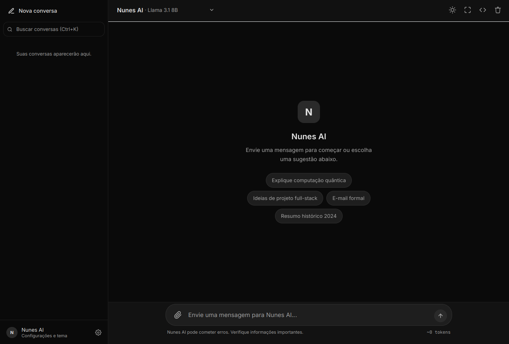
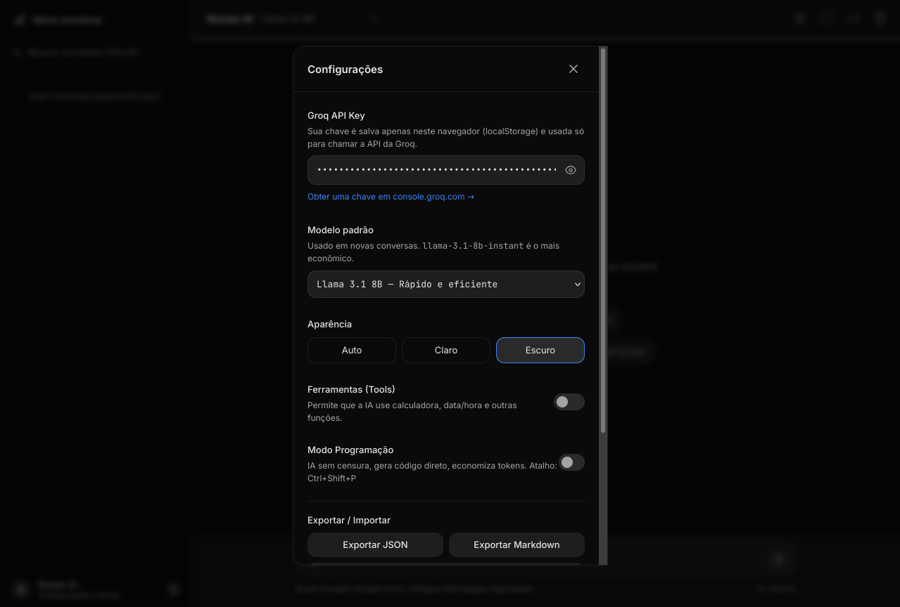

<div align="center">

# 🧠 NovaMind

**Assistente de IA inteligente, rápido e sem censura — rodando via Groq API**

<p>
  <a href="https://slutzinn.github.io/NovaMind/">
    
  </a>
  
  
  
</p>

<p>
  
  
  
</p>

[🌐 Live Demo](https://slutzinn.github.io/NovaMind/) • [📄 LICENSE](LICENSE) • [🐛 Issues](https://github.com/slutzinn/NovaMind/issues) • [💬 Discussions](https://github.com/slutzinn/NovaMind/discussions)

</div>

---

## 📋 Índice

- [Sobre](#-sobre)
- [Funcionalidades](#-funcionalidades)
- [Screenshots](#-screenshots)
- [Tecnologias](#-tecnologias)
- [Arquitetura](#-arquitetura)
- [Como Usar](#-como-usar)
- [Modo Programação](#-modo-programação)
- [Ferramentas (Tools)](#-ferramentas-tools)
- [Atalhos de Teclado](#-atalhos-de-teclado)
- [Configurações Avançadas](#-configurações-avançadas)
- [Roadmap](#-roadmap)
- [Contribuição](#-contribuição)
- [Licença](#-licença)
- [Autor](#-autor)

---

## 🎯 Sobre

**NovaMind** é um assistente de conversação inteligente desenvolvido por **NunesXYZ** ([@slutzinn](https://github.com/slutzinn)) como projeto pessoal de ponta. Diferente de outras interfaces de IA, o NovaMind foi construído com foco total em:

- **🚀 Performance extrema** — Utiliza a API da Groq, uma das mais rápidas do mercado, com latência média de ~300ms
- **🔓 Liberdade total** — Modo Programação sem censura para desenvolvedores
- **📱 Experiência mobile-first** — PWA instalável, interface responsiva, suporte a gestos e safe areas
- **🎨 Personalização profunda** — Temas claro/escuro/auto, cores de ênfase customizáveis, densidade de interface ajustável
- **🔒 Privacidade** — Todas as conversas ficam no `localStorage` do navegador, zero dados no servidor

> ⚠️ **Aviso:** Este projeto é de propriedade exclusiva de NunesXYZ. O código-fonte está protegido por licença proprietária restritiva. Veja o arquivo [LICENSE](LICENSE) para detalhes completos.

---

## ✨ Funcionalidades

### 💬 Chat Inteligente
- Streaming de respostas em tempo real com cursor piscante
- Suporte a múltiplas conversas com histórico persistente
- Busca dentro das conversas (Ctrl+F)
- Responder mensagens específicas (reply/quote)
- Editar mensagens enviadas e regenerar respostas
- Continuar geração quando a resposta é truncada
- Contador estimado de tokens em tempo real

### 🧠 Modelos de IA Suportados
| Modelo | Descrição | Uso Ideal |
|--------|-----------|-----------|
| `llama-3.1-8b-instant` | Rápido e econômico | Respostas rápidas, tarefas simples |
| `llama-3.3-70b-versatile` | Mais inteligente e capaz | Complexidade alta, raciocínio profundo |
| `llama-3.1-70b-versatile` | Equilibrado | Uso geral, bom custo-benefício |
| `mixtral-8x7b-32768` | Contexto amplo | Documentos longos, análises extensas |

### 🛠️ Ferramentas Integradas (Tools)
- 🧮 **Calculadora** — Expressões matemáticas em tempo real
- 📅 **Data/Hora atual** — Informações temporais precisas
- 🎲 **Número aleatório** — Geração de inteiros entre min/max
- 🔍 **Busca Web** — DuckDuckGo via proxy de texto
- 🌤️ **Clima** — Previsão do tempo por coordenadas geográficas
- 🌐 **Tradução** — LibreTranslate para múltiplos idiomas
- 📰 **Notícias** — Busca de notícias recentes por tema

### 🎨 Interface & UX
- **Temas:** Escuro, Claro e Auto (segue sistema)
- **Modo Zen:** Interface minimalista sem distrações
- **Sidebar colapsável:** Em desktop para mais espaço de leitura
- **Animações suaves:** Com opção de redução de movimento
- **Acessibilidade:** ARIA labels, foco visível, skip links, suporte a screen readers
- **Safe areas:** Compatível com iPhone notch, Dynamic Island e Android gesture bars
- **PWA:** Instalável como app nativo, manifest e service worker inclusos

### 🎤 Multimodal
- **Entrada de voz:** Speech-to-Text nativo do navegador (Web Speech API)
- **Transcrição de áudio:** Suporte a MP3, WAV, M4A, OGG, WEBM via API Whisper da Groq
- **Text-to-Speech:** Leitura em voz alta das respostas da IA
- **Geração de imagens:** Comando `/imagine <prompt>` via Pollinations.ai
- **Download de áudio:** Geração de WAV sintético a partir de texto

### 📁 Gestão de Dados
- **Exportar:** JSON (estrutura completa) e Markdown (formato legível)
- **Importar:** Restaurar conversas de arquivos JSON
- **Anexos:** Upload de arquivos de texto e código (TXT, MD, JS, TS, PY, HTML, CSS, JSON, CSV, LOG)
- **Persistência:** 100% local via localStorage — suas conversas nunca saem do seu dispositivo

### ⚙️ Configurações Avançadas
- Cor de ênfase customizável (hex picker)
- Tamanho de fonte ajustável (13px ~ 20px)
- Largura máxima do chat (Estreita / Média / Larga / Tela cheia)
- Densidade da interface (Confortável / Compacta)
- Timestamps opcionais em cada mensagem
- Animações ligáveis/desligáveis
- System prompt personalizado por conversa

---

## 📸 Screenshots

<div align="center">

### 🖥️ Interface Principal — Tema Escuro

<p>
  
</p>

<p><em>A tela inicial mostra a interface completa: sidebar com histórico de conversas agrupadas por data (Hoje, Ontem, Últimos 7 dias), header com seletor de modelo de IA, área de chat central e barra de input com suporte a anexos e voz.</em></p>

---

### ⚡ Modo Programação — Geração de Código sem Censura

<p>
  
</p>

<p><em>Quando o Modo Programação está ativo (badge PROG verde no header), a IA gera código direto sem floreios, sem censura e com economia máxima de tokens. Ideal para desenvolvedores que precisam de respostas técnicas rápidas.</em></p>

---

### ⚙️ Painel de Configurações Avançadas

<p>
  
</p>

<p><em>O modal de configurações permite personalizar tudo: desde a Groq API Key até a cor de ênfase, tamanho da fonte, largura do chat, densidade da interface e comportamento de animações/timestamps.</em></p>

</div>

---

## 🛠 Tecnologias

### Frontend
- **HTML5** — Estrutura semântica com ARIA
- **Tailwind CSS** — Estilização utilitária via CDN com config customizada
- **CSS Custom Properties** — Variáveis para temas dinâmicos (dark/light)
- **JavaScript Vanilla** — Zero frameworks, código otimizado e modular

### Bibliotecas & APIs
- **Marked.js** — Parser Markdown com renderer customizado
- **DOMPurify** — Sanitização de HTML para segurança XSS
- **Highlight.js** — Syntax highlighting de código com 180+ linguagens
- **Groq API** — Inferência de LLMs em alta velocidade
- **Pollinations.ai** — Geração de imagens por prompt
- **Open-Meteo** — Dados meteorológicos gratuitos
- **LibreTranslate** — Tradução de textos
- **Jina AI** — Proxy de leitura de páginas web

### PWA & Mobile
- **Web App Manifest** — Instalação como app nativo
- **Service Worker** — Cache básico e suporte offline
- **Safe Area Insets** — Compatibilidade com notch e gesture bars
- **Viewport fixes** — Prevenção de zoom em inputs mobile

---

## 🏗 Arquitetura

```
┌─────────────────────────────────────────────────────────────┐
│                      NOVAMIND                               │
│                    (Single Page Application)                  │
├─────────────────────────────────────────────────────────────┤
│  ┌──────────────┐  ┌──────────────┐  ┌─────────────────┐  │
│  │   Sidebar    │  │   Chat Area  │  │   Composer Bar  │  │
│  │  (Sessions)  │  │ (Messages)   │  │  (Input + Send) │  │
│  └──────────────┘  └──────────────┘  └─────────────────┘  │
├─────────────────────────────────────────────────────────────┤
│  ┌──────────────┐  ┌──────────────┐  ┌─────────────────┐  │
│  │  Settings    │  │   Modals     │  │  Search Overlay │  │
│  │   Modal      │  │ (Confirm,    │  │   (Ctrl+F)      │  │
│  │              │  │  Rename, etc)│  │                 │  │
│  └──────────────┘  └──────────────┘  └─────────────────┘  │
├─────────────────────────────────────────────────────────────┤
│                         Data Layer                          │
│  • localStorage (sessions, settings, drafts, queue offline) │
│  • Groq API (streaming chat completions + tool calls)       │
│  • External APIs (weather, translate, news, images)         │
└─────────────────────────────────────────────────────────────┘
```

### Fluxo de Dados
```
Usuário → Input → Composer → sendMessage()
                              ↓
                    ensureSessionForSend()
                              ↓
                    streamAssistantReply()
                              ↓
              ┌───────────────┼───────────────┐
              ↓               ↓               ↓
         Groq API      Tool Calls      Offline Queue
         (streaming)   (calculator,   (quando offline)
                        weather, etc)
              ↓               ↓
         Live Render    Handler Local
         (Markdown)     (JS puro)
              ↓
         persistSessions()
              ↓
         localStorage
```

---

## 🚀 Como Usar

### 🌐 Acesso Online (Recomendado)

O NovaMind está hospedado no **GitHub Pages** e pode ser acessado diretamente:

👉 **[https://slutzinn.github.io/NovaMind/](https://slutzinn.github.io/NovaMind/)**

Basta abrir o link, configurar sua Groq API Key e começar a usar!

### 1. Pré-requisitos
- Navegador moderno (Chrome, Firefox, Safari, Edge)
- Uma **Groq API Key** gratuita em [console.groq.com](https://console.groq.com/keys)

### 2. Instalação Local

```bash
# Clone o repositório (se tiver acesso autorizado)
git clone https://github.com/slutzinn/NovaMind.git

# Ou simplesmente abra o index.html no navegador
cd NovaMind
open index.html
```

### 3. Primeiro Uso
1. Acesse [https://slutzinn.github.io/NovaMind/](https://slutzinn.github.io/NovaMind/) ou abra o `index.html` localmente
2. Clique em **"Configurações"** (engrenagem no sidebar)
3. Cole sua **Groq API Key** no campo indicado
4. Escolha seu modelo padrão
5. Salve e comece a conversar!

### 4. Comandos Especiais
```
/imagine <descrição>     → Gera imagem via IA
Ctrl+Enter               → Enviar mensagem
Ctrl+Shift+N             → Nova conversa
Ctrl+Shift+P             → Ativar/Desativar Modo Programação
Ctrl+Shift+M             → Alternar tema
Ctrl+K                   → Buscar conversas
Ctrl+/                   → Focar no input
Ctrl+F                   → Buscar na conversa atual
Esc                      → Fechar modais
```

---

## 🔓 Modo Programação

O **Modo Programação** é uma das funcionalidades exclusivas do NovaMind. Quando ativado (via botão ⚡ ou `Ctrl+Shift+P`), a IA opera sob regras especiais:

| Característica | Modo Normal | Modo Programação |
|----------------|-------------|------------------|
| Censura | Padrão (segue diretrizes) | **Zero censura** |
| Introduções | Educadas e completas | **Direto ao ponto** |
| Geração de código | Pode recusar tópicos sensíveis | **Aceita qualquer request** |
| Explicações | Detalhadas por padrão | **Código primeiro, explicação depois** |
| Tokens | Uso padrão | **Economia máxima** |
| Nível técnico | Generalista | **Sênior de elite** |

### Quando usar:
- Desenvolvimento de scripts e automações
- Reverse engineering educacional
- Testes de segurança (pentest) em ambientes controlados
- Geração de código sem restrições de framework
- Debugging avançado e otimização de performance

> ⚠️ **Responsabilidade:** O usuário é o único responsável pelo uso do código gerado. O NovaMind não se responsabiliza por aplicações maliciosas ou ilegais.

---

## 🧰 Ferramentas (Tools)

As ferramentas podem ser ativadas nas Configurações. Quando habilitadas, a IA detecta automaticamente quando precisa usar uma função e a executa em tempo real.

### Exemplos de uso:
```
Usuário: "Quanto é 234 * 567?"
IA: [Usa calculator] → 132,678

Usuário: "Que dia é hoje?"
IA: [Usa get_current_datetime] → Segunda-feira, 13 de julho de 2026

Usuário: "Como está o tempo em São Paulo?"
IA: [Usa get_weather com lat/lon de SP] → 24°C, vento 12 km/h

Usuário: "Busque notícias sobre inteligência artificial"
IA: [Usa get_news] → [Resumo das últimas notícias]
```

---

## ⌨️ Atalhos de Teclado

| Atalho | Ação |
|--------|------|
| `Ctrl + Enter` | Enviar mensagem |
| `Ctrl + Shift + N` | Nova conversa |
| `Ctrl + K` | Buscar conversas |
| `Ctrl + /` | Focar no campo de mensagem |
| `Ctrl + Shift + O` | Abrir configurações |
| `Ctrl + Shift + M` | Alternar tema claro/escuro |
| `Ctrl + Shift + P` | Ativar/desativar Modo Programação |
| `Ctrl + F` | Buscar na conversa atual |
| `Esc` | Fechar modais / limpar foco |
| `Ctrl + ?` | Ver todos os atalhos |

---

## ⚙️ Configurações Avançadas

Acesse via **⚙️ Configurações** no sidebar:

### Aparência
- **Tema:** Auto / Claro / Escuro
- **Cor de ênfase:** Escolha qualquer cor hexadecimal
- **Tamanho da fonte:** 13px a 20px
- **Largura do chat:** 672px / 768px / 896px / 100%
- **Densidade:** Confortável (padrão) ou Compacta

### Comportamento
- **Animações:** Ligadas / Desligadas
- **Timestamps:** Mostrar hora em cada mensagem
- **Ferramentas:** Habilitar/desabilitar tool calling
- **Modo Programação:** Ativar/desativar

### Dados
- **Exportar JSON:** Backup completo da conversa
- **Exportar Markdown:** Formato legível para humanos
- **Importar JSON:** Restaurar conversas de backup
- **Limpar histórico:** Apagar todas as conversas permanentemente

---

## 🗺 Roadmap

### ✅ Implementado
- [x] Chat streaming com múltiplos modelos Groq
- [x] Modo Programação sem censura
- [x] Tool calling (7 ferramentas)
- [x] Temas escuro/claro/auto
- [x] PWA instalável
- [x] Busca em conversas
- [x] Reply/quote em mensagens
- [x] Edição e regeneração de mensagens
- [x] Voice input (Web Speech API)
- [x] Transcrição de áudio (Whisper)
- [x] Geração de imagens (/imagine)
- [x] Export/Import de conversas
- [x] System prompt por conversa
- [x] Offline queue
- [x] Acessibilidade completa (ARIA)
- [x] **GitHub Pages** — Hospedagem online gratuita

### 🚧 Em Desenvolvimento
- [ ] Upload de imagens para análise (vision models)
- [ ] RAG com embeddings locais
- [ ] Plugins de terceiros (extensões)
- [ ] Sincronização entre dispositivos (criptografada)
- [ ] App nativo Android/iOS (Capacitor)
- [ ] Suporte a múltiplas APIs (OpenAI, Anthropic, local)

### 💡 Ideias Futuras
- [ ] Agentes autônomos com memória de longo prazo
- [ ] Integração com GitHub, VS Code, terminal
- [ ] Colaboração em tempo real (multiplayer chat)
- [ ] Fine-tuning de modelos personalizados

---

## 🤝 Contribuição

Este projeto é de **propriedade exclusiva de NunesXYZ** e não aceita contribuições externas no momento.

Se você encontrou um bug ou tem uma sugestão:
1. Abra uma **Issue** no GitHub
2. Descreva o problema com detalhes e passos para reproduzir
3. Inclua screenshots se possível

> ⚠️ Pull Requests não serão aceitos sem autorização prévia por escrito.

---

## 📜 Licença

```
LICENÇA PROPRIETÁRIA NUNES AI / NOVAMIND
Copyright (c) 2024-2026 NunesXYZ. Todos os direitos reservados.
```

Este software é propriedade intelectual exclusiva de **NunesXYZ**.

**É EXPRESSAMENTE PROIBIDO:**
- ❌ Copiar, clonar ou reproduzir o código
- ❌ Distribuir, publicar ou compartilhar o software
- ❌ Modificar, fazer engenharia reversa ou criar obras derivadas
- ❌ Remover ou ocultar avisos de direitos autorais
- ❌ Publicar em repositórios públicos ou privados de terceiros
- ❌ Vender, alugar ou transferir o software

**Violações sujeitam o infrator a:**
- Ações cíveis e criminais por violação de direitos autorais
- Indenização por danos materiais e morais
- Medidas cautelares e liminares
- Apreensão de equipamentos

Para o texto completo, consulte o arquivo [LICENSE](LICENSE).

---

## 👤 Autor

<div align="center">

**NunesXYZ** — *Criador e Desenvolvedor*

<p>
  <a href="https://github.com/slutzinn">
    
  </a>
</p>

> *"Código é poesia. Liberdade é direito. Privacidade é não negociável."*
> — NunesXYZ

</div>

---

<div align="center">

**⭐ Se este projeto te impressionou, deixe uma star no repositório!**

**🔒 Protegido por NunesXYZ — Todos os direitos reservados.**

</div>
